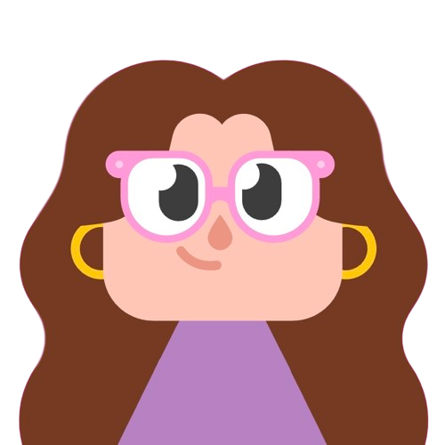

  

  

  
  

    <h1>
        Hi! I'm Ash!
        
    </h1>

:seedling: I am a full stack software engineering bootcamp student (July '23 grad) seeking a Software Engineering role.

:telescope: In addition to my bootcamp curriculum I am also working through The Odin Project and Colt Steele's Web Development Udemy course.

:alien: :notes: :art: :jack_o_lantern: In my free time I enjoy fiber arts, reading, playing guitar, digital painting, and tabletop gaming.

